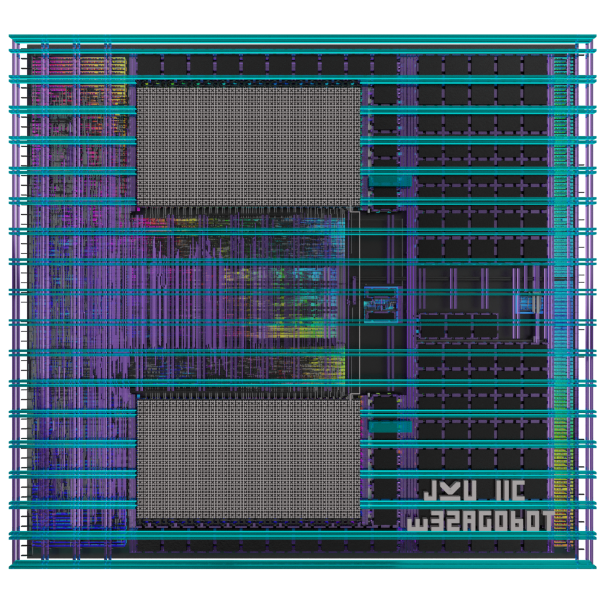
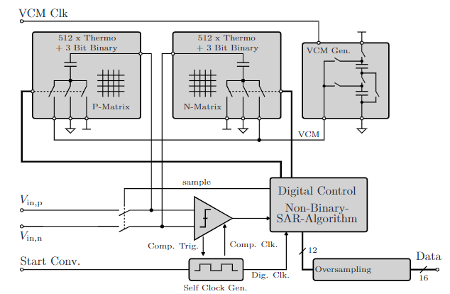
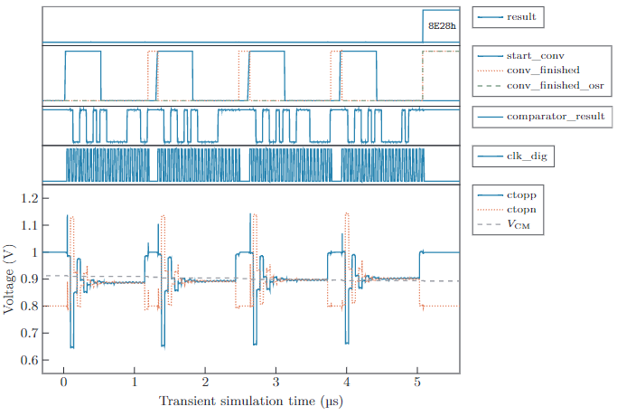
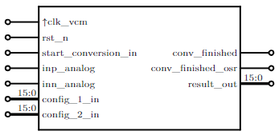

# Design of a 1.2MS/s Charge-Redistribution Non-Binary SAR-ADC utilizing the SKY130 Open-Source Technology
Author: Manuel Moser, 2023, Johannes Kepler University (JKU) Linz, Austria, Institute for Integrated Circuits (IIC).  
This SAR-ADC has been designed in the context of a Master's thesis, the related documentation is being published on the [JKU ePUB repository](https://epub.jku.at/nav/classification/4815227) soon.


**Figure 1**: 3D render of the SAR-ADC layout made with Blender and [gdsiistl](https://github.com/andrsmllr/gdsiistl). 

# Abstract
 The proposed design is a versatile non-binary, asynchronous (= self clocked) 12 bit SAR-ADC (successive approximation register analog-to-digital converter), using a segmented 12 bit capacitive DAC with 9 bit thermometer-coded capacitor array and 3 bit binary capacitor cells. The SAR-ADC Layout has previously been added to the [IIC Mixed-Signal Circuits Submission](https://github.com/iic-jku/mpw8-submission) for the Open MPW-8 Shuttle.  

  
**Figure 2**: The block diagram of the proposed 12-bit SAR-ADC. Image obtained and adapted from [1]. 

## Key Features 
* Differential analog inputs.
* ADC physical resolution of 12 bit, up to 16 bit with oversampling.
* Sample rate configurable in a broad range from 28S/s (low-power biosensor applications) up to 1.2MS/s. 
* Non-binary SAR weights for error correction capability.
* Oversampling FIR boxcar filter with 1/4/16/64/256 samples to increase the resolution.
* Averaging of 4 least significant SAR weights with 1/3/7/15/31 samples to reduce the impact of comparator noise.
* Clock generator with a configurable frequency. The clock generator layout has been hardened with `OpenLane` using a gate level description of the clock loop. The delay elements in the loop use a custom high-delay standard cell `sky130_mm_sc__hd_dlyPoly5ns` which fits into the `sky130_fd_sc__hd_` standard cell grid.
* Integrated switched capacitor voltage generator for the common mode reference voltage.
* 12 bit capacitor DAC:
  * Unit capacitor with $C^{1}$=0.447 fF.
  * 3 bit binary-coded cells with 1x1, 1x2 and 1x4 unit capacitors $C^{1}$ + $C^{2}$ + $C^{4}$ for LSB bits.
  * 9 bit thermometer-coded cells with 1x8 unit capacitors $C^{8}_{1..511}$=3.58 fF.
  * The total capacitance per DAC matric is 1.83 pF.
* The thermometer-code row/column decoder can be switched from a sequential to a symmetrical mode to decrease the integral nonlinearity error.
* Total area of $442 \mu m \cdot 402\mu m = 178.000 \mu m^2$, the area decreases to $124.000 \mu m^2$ if the $V_\mathrm{CM}$ voltage generator is not included.
* 100% open source, licensed with [Apache 2.0](LICENSE)

# Performance characteristics
Characterization of the ADC has been done through post-layout simulation with parasitic C extraction. For the typical setting, the SAR-ADC has been configured to use 3 samples per LSB averaging, 4 samples oversampling, and a symmetric thermometer-code sequence. The clock generator has been set to use the lowest delay configurations (`00001`), as a result, the ADC is sampling at 824 kS/s with a Nyquist bandwidth of 103 kHz. The waveforms obtained in the simulation can be seen in Fig. 3, and the results are summarized in Table 1.

  
**Figure 3**: The plots show the simulation result of the post-layout simulation at 3 samples per average, oversampling factor 4, and 824 kS/s sample rate. 

**Table 1**: Summary of the SAR-ADC characteristics obtained from simulation.

 |Parameter                 |  Min     | Typ      | Max        |  
 |--------------------------|----------|----------|------------|  
 | $V_\mathrm{DD}$ (V)      | -        |$1.8$     | -          |
 | Area (µm²)               |$0.124^a$ |$0.178$   | -          |
 | DAC resolution (bit)     | -        |$12 $     | -          | 
 | Result (bit)             | -        |$12 $     |$16$        | 
 | Oversampling factor      |$1   $    |$4  $     |$256$       |
 | LSB Averaging (samples)  |$1   $    |$3  $     |$31$        |
 | Sample rate (kS/s)       |$7.36$    |$824$     |$1203$      |
 | Nyquist Bandwidth (kHz)  |$0.014$   |$103$     |$602$       |
 | Average PD (µW)          |$68^b$    |$335^c$   | -          |  

$^a$ Without the integrated $V_\mathrm{CM}$ generator.  
$^b$ Low-power test case, delay_1,2,3 = 11111, $N_\mathrm{avg}$ = 31.  
$^c$ Typical-power test case, delay_1,2,3 = 00001, $N_\mathrm{avg}$ = 3.  

# Top-Level Interface
The configuration bytes `config_1_in` and `config_2_in` are used to activate the sequential/symmetrical row/column decoder modes and to configure the delays in the self-clocked loop. The configuration port mapping is described in [doc/interface.md](doc/Interface.md). `rst_n` will reset the circuit active-low. After reset de-assertion the circuit waits for the trigger signal `start_conversion_in`, an edge-detection-circuit ensures that only one conversion is triggered if the start signal stays high. A single conversion is done when `conversion_finished_out` changes to `HIGH`, additionally, `conversion_finished_osr_out` signalizes a finished OSR sequence and an update of the result at the output. Input signal `clk_vcm` is the clock signal for the switched-capacitor voltage generator, it is designed for a low frequency of 32.768 kHz.

  
**Figure 4**: Block diagram of the SAR-ADC

```verilog
//Top module ADC Control
module adc_top(
   `ifdef USE_POWER_PINS
      inout VDD,	// User area 1.8V supply
      inout VSS,	// User area ground
   `endif
   input wire clk_vcm,        // 32.768Hz VCM generation clock
   input wire rst_n,          // reset
   input wire inp_analog,     // P differential input
   input wire inn_analog,     // N differential input
   input wire start_conversion_in,   
   input wire [15:0] config_1_in,    
   input wire [15:0] config_2_in,    
   output wire [15:0] result_out,       // format: {12 bit, 4 bit OSR extension}    
   output wire conversion_finished_out,
   output wire conversion_finished_osr_out
   );
```

# References
[1] S. Schmickl, T. Faseth and H. Pretl, "An Untrimmed 14-bit Non-Binary SAR-ADC Using 0.37 fF-Capacitors in 180 nm for 1.1 µW at 4 kS/s," 2020 27th IEEE International Conference on Electronics, Circuits and Systems (ICECS), Glasgow, UK, 2020, pp. 1-4, doi: 10.1109/ICECS49266.2020.9294971.
