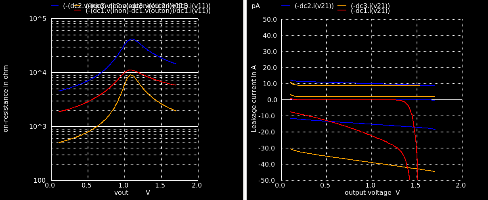
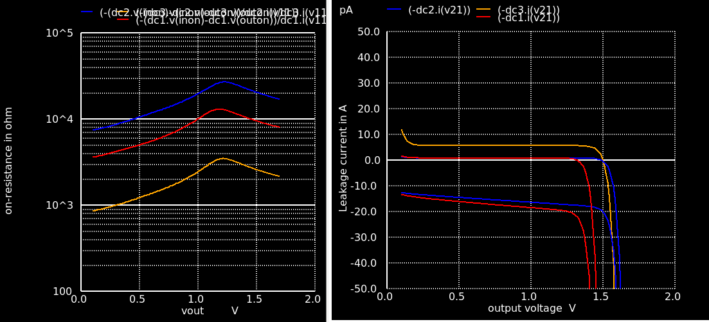
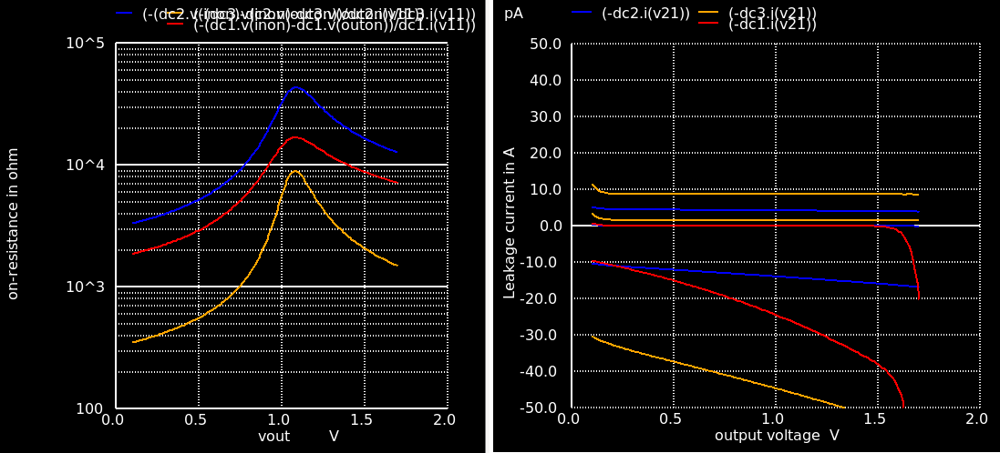
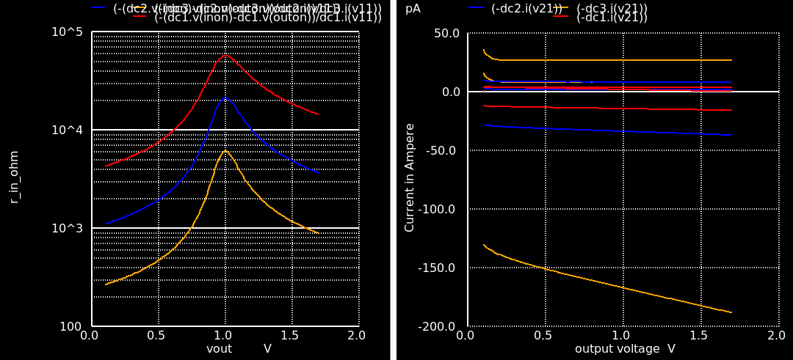
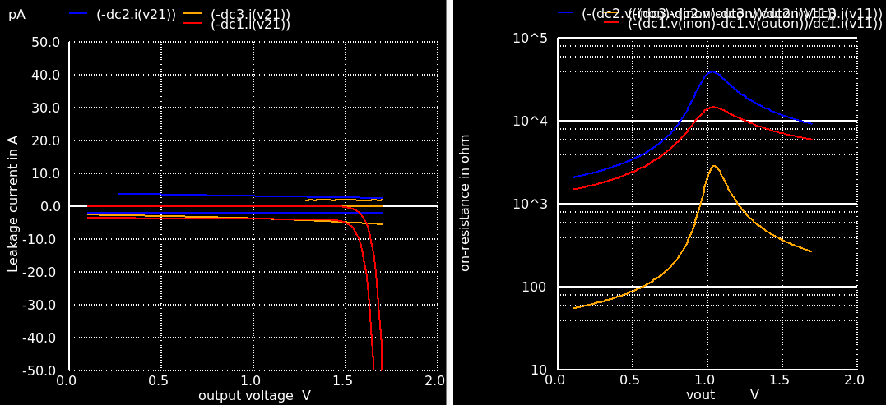
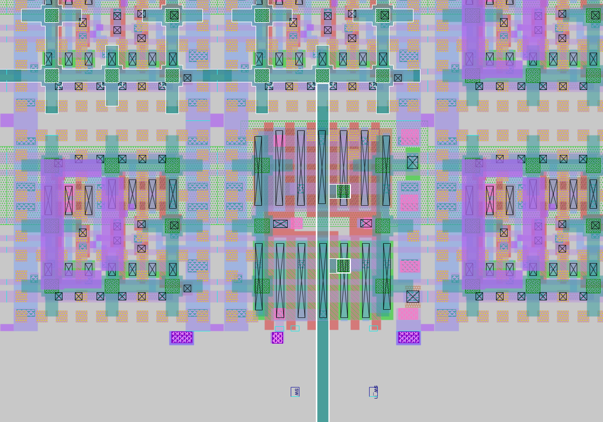

# ADC Gate Switch Dimensionierung
Evaluierung der Parasitics und Auswahl der Mosfet-Types und Dimensionen (nom, lvt, hvt, thickoxide)

## Ergebnis
Die Grenzwerte für Sampling in 20ns und Leakage-Current für 1LSB Genauigkeit sind:  
$R_{on}^{max}=985\Omega$  
$\tau^{max} = 2.4ns$  
$I_{Leakage}^{max}=13.14pA$  

Um exponentiell wachsenden Leakage an den Spannungsgrenzen zu vermeiden wurde `L=0.22` als guter Kompromiss bestimmt. Mit `W=7.6` ist die On-Resistance niedrig genug um die Cap schnell genug bei Corner `tt` zu laden. Die Ergebnisse sind nicht gut genug beim Fast-Corner (100°C und `ff`), aber bei Fokus auf den `tt`-Corner und 25°C werden die Vorgaben eingehalten.

## Sampling-Phase
Der Gate-Switch soll bei minimaler Sampling-Dauer bei Änderung der Eingangsspannung von $V_{in}=0V$ auf $V_{in}=1.8V$ die ADC-Cap auf $V_{cap}=V_{max}-1\cdot LSB$ aufladen können. 

### Berechnung der maximalen erlaubten Switch-Resistance

* Bei einem 12-Bit ADC ist $LSB=1.8V \cdot \frac{1}{4096}=440 \mu V$.
* Geht man vom kleinsten sinnvollen Delay aus, dann ist die kürzeste Clk-Periode des Digital-Clk $T_{clk}=20ns$. 
* Bei kontinuierlicher AD-Wandlung ist die kürzeste Samplezeit deshalb $\Delta t = 20 ns$. In dieser Zeit muss es möglich sein den ADC-Kondensator von $U_c(0)=0V$ auf $U_c(\Delta t)=1.8V \frac{4095}{4096}$ aufzuladen.

Der zeitabhängige Spannungsverlauf der Matrix-Kapazität $U_c(t)$ beim Aufladen ist 

$$U_c(t) = U_0 \left( 1-e^{-\frac{t}{RC}} \right) $$

Einsetzen von $t=\Delta t$ und anschließender Umformung führt zu

$$ln \left( \frac{U_0}{U_0-U_c(\Delta t)} \right)  = \frac{\Delta t}{RC}$$

Werte Einsetzen für $U_c(\Delta t) > 1.8V \frac{4095}{4096}$, $U_0=1.8V$ und $C=2.44pF$

$$ln(4096)  < \frac{\Delta t}{RC}$$

daraus folgt der erlaubten Kanalwiderstand

$$R<\frac{\Delta t}{C \cdot ln(4096)} = \frac{20ns}{2.44pF \cdot ln(4096)}=985\Omega$$

## Hold-Phase
Während der Hold-Phase soll sich der gesampelte Kondensator-Spannungswert vom Startwert um weniger als $1 \cdot LSB$ unterscheiden. Maßgeblich sind die maximale Hold-Dauer, Charge-Injection und Leakage-Current.

## Berechnung des maximal erlaubten Leakage-Currents
Worst Case: 
* Bei langsamen Corner (`ss`, $T=-20 ^\circ C$, $V_{cm}=700mV$ ) benötigt das Comparator-Latch $\Delta t = 20 ns$ für eine Entscheidung, allerdings ist der Leakage-Current im  schnellen `ff`-Corner wichtiger. 
* Der Delay-Loop führt bei maximalem Delay-Setting zu ($\Delta t = 600 ns$) Periodendauer je Messwert. 
* Bei Averaging von 4 LSB-Bits mit je 31 Samples sind $12+4 \cdot 31=136$ Cycles für eine vollständige Umwandlung nötig. 
* Die erlaubte Spannungsänderung während der Hold-Phase ist $LSB=440uV$
* OSR ist hier nicht berücksichtigt, da nach einer erfolgten Wandlung neu gesampled wird.

Die maximale Hold-Zeit in der die Spannung am Kondensator stabil bleiben soll: 

$$T_{hold} = 136 cycles \cdot 600 ns/cycle=81.6 \mu s$$ 

Die zugehörige Sample-Rate (ohne Oversampling) ist:

$$Samplerate = 1/T_{hold}=12254/s$$

Die Spannung am Kondensator darf sich worst-case nach $\Delta t = 81.6 \mu s$ um $\Delta U_C < 1 LSB$ ändern.Der erlaubte Leakage-Current errechnet sich nun aus der Strom/Spannungsbeziehung für Kapazitäten:

$I_{leakage} = C \frac{\Delta U_c}{\Delta t} < C \frac{LSB}{\Delta t}=2.44 pF \frac{1.8V}{4096 \cdot 81.6 \mu s}=13.14 pA$  

Die Oversampling-Rate ist hier nicht zu berücksichtigen, weil nach $T_{hold}$ neu gesampled wird.

## Mögliche Sample-Rate im Worst-Case Corner
Angenommen im Delay-Loop ist die Summe der Delays auf sehr schnelle $T_{delays} = 10 ns$ eingestellt, und die Comparator-Entscheidungszeit beträgt $T_{decision} = 20ns$ bei $V_{cm}=700mV$, dann ist die Clock-Periodendauer $T_{loop}=2\cdot 10ns+20ns=40ns$. Bei 16 States für eine Wandlung (kein Average, kein OSR) ergibt das eine Samplerate von

$$Samplerate = 1/(16 \cdot 40ns)=1.56MSamples/s$$ 

## Mögliche Sample-Rate im Best-Case Corner
Hier liegt die Comparator-Entscheidungszeit bei  $T_{decision} = 2.2ns$.
$$Samplerate = 1/(16 \cdot 22.2ns)=2.84MSamples/s$$ 

# Switch Topologieauswahl bei Fast-Corner
Spezifikationen können hier nicht eingehalten werden, die Leakage Current wird zu hoch wenn man in einen okay'ishen On-Resistance-Bereich kommt, egal welche Topologie gewählt wird.

## 01V8 Nominal Mosfets
R zu hoch wenn Leakage current ebenfalls zu hoch
```tcl
red: w=0.42 L=0.15
blue: w=0.42 L=0.4
orange: W=4 L=0.4
```

Abb: Leakage Currents und Channel-Resistance bei worst case corner (ff 100°C)

## 01V8 LVT Mosfets
Die LVT Type hat ein noch großes Problem mit Leakage Currents
```tcl
red: w=0.42 L=0.35
blue: w=0.42 L=0.75
orange: W=4 L=0.75
```

Abb: Leakage Currents und Channel-Resistance bei worst case corner (ff 100°C)

## 01V8 HVT Mosfets
NMOS nominal und PMOS hvt
Der Theorie nach sinkt der Leakage Current mit stärker dotiertem Kanal, was bei HVT der Fall wäre, gleichzeitig muss aber die Width steigen um die On_resistance wieder zu kompensieren. Ergebnis: R zu hoch wenn Leakage current ebenfalls zu hoch
```tcl
red: w=0.42 L=0.15
blue: w=0.42 L=0.30
orange: W=4.2 L=0.30
```

Abb: Leakage Currents und Channel-Resistance bei worst case corner (ff 100°C)

## Thick Oxide G5V0 Mosfets
Leakage currents sind bei vergleichbarer Channel Resistance sogar noch höher als bei andere types.
```tcl
red: w=0.42 L=0.5
blue: w=4 L=0.5
orange: W=16 L=0.5
```

Abb: Leakage Currents und Channel-Resistance bei worst case corner (ff 100°C)

# Bootstrapping Switch?
Wenn, dann: Wandlung um 1 Cycle verlängern, im IDLE Zustand die Bootstrapping Cap laden, im ersten Clock Cycle den Switch schalten, dann erst die Wandlung durchführen.

Vorteil: zusätzlich Energieeffizient, Ron von Vin unabhängig  
Nachteil: aufwändig, große Cap nötig, Mosfet mit höherer Spannung nötig aber 3V3 hat furchtbaren leakage Current und g5V0 benötigt am Gate ordentlich viel Spannung/Ladung sonst erreicht der Ausgang niemals 1.8V. Siehe zugehörige Testbench

Idee deshalb verworfen.

# Topologieauswahl bei Typical-Corner
## 01V8 Nominal Mosfets
```tcl
red: w=0.42 L=0.15
blue: w=0.42 L=0.22
orange: W=7.6 L=0.22
```

Abb: Leakage Currents und Channel-Resistance bei nominal corner (tt 25°C)


Abb: Leakage Currents und Channel-Resistance bei fast corner (ff 25°C)

# Auswahl
Nominal `01V8` PMOS/NMOS ohne Bootstrapping mit
`W=7.6` `L=0.22` `nf=4` und Charge-Injection-Compensation am Ausgang `W=3.8` `L=0.22` `nf=2`, ist der größte Switch mit Charge Compensation der Platz hat, allerdings musste Metal2 für Routing verwendet werden, wird aber in Kauf genommen da eine große M4-M2 Kapazität im Gate-Teil unerwünscht ist, und die Anwesenheit von intaktem M3 und M4 fürs Matching wichtiger sein sollte.

