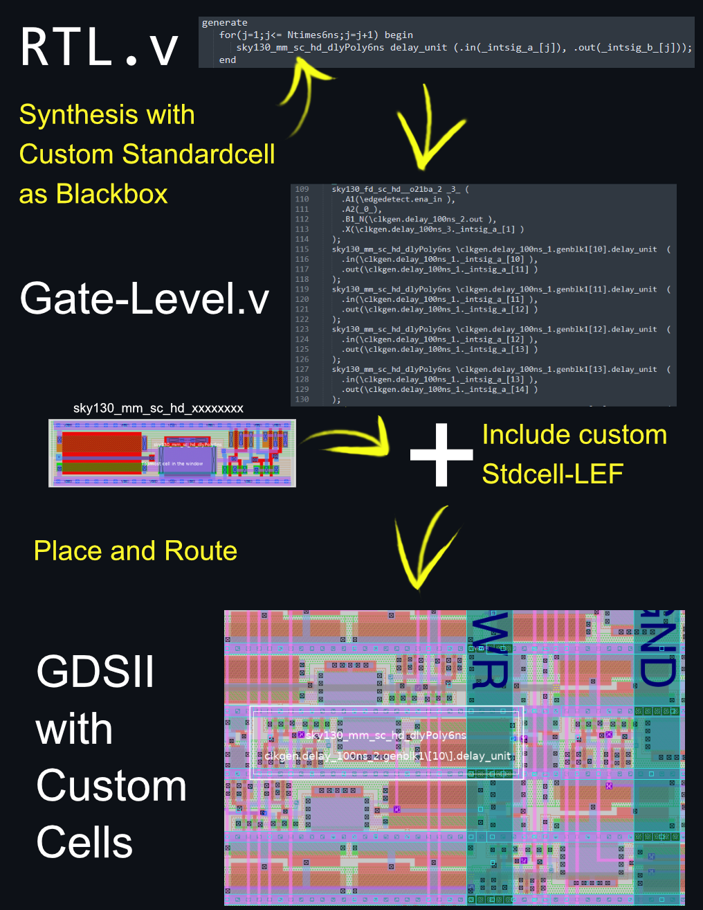
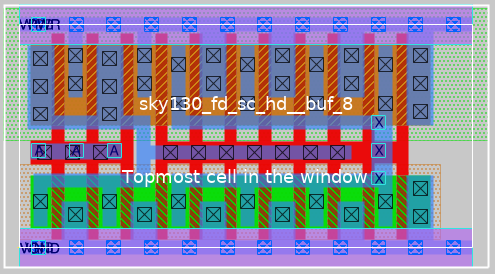
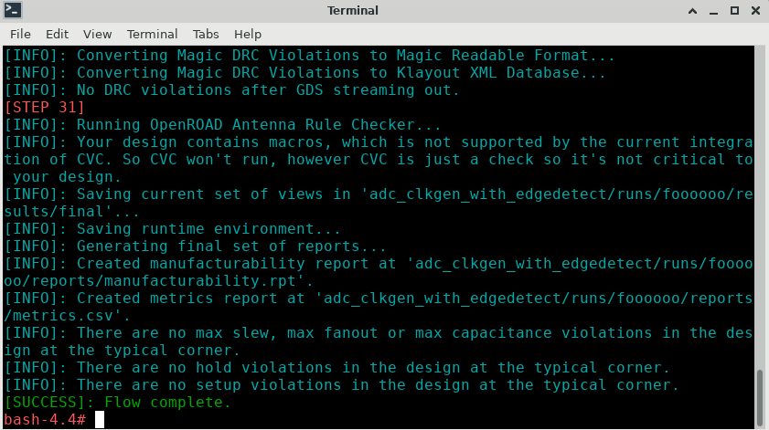
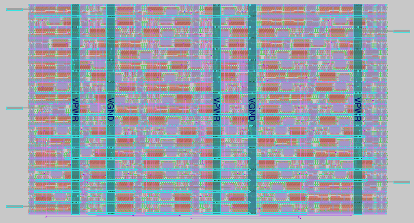

# SKY130 from RTL with Custom-Standardcells to GDSII Macrocell

This workflow is written for the SKY130 [iic-osic-tools](https://github.com/hpretl/iic-osic-tools) design environment.



### Workaround for falsely-expected macros
UPDATE: MPL-0004 has been changed to a warning, which means the workaround should not be needed after an update of openlane. 

Openlane expects macros if a lef-file is added to the design, which is false since we are adding a custom standardcell. Macros are handled different to standardcells in terms of placement and power-distribution. Standardcells are placed inside of a horizontal power-grid on Metal1 after the PDN on metal1 and metal4 have been generated and routed. The result is a hardened macro. Macros should therefore already have a vertical PDN on Metal4, they should be connected to the horizontal PDN on Metal5 later. Until an official solution is out, disable `basic_macro_placement` in `/foss/tools/openlane/2022.07/scripts/tcl_commands/floorplan.tcl` as suggested in Slack.

You ned root-access for this workaround. Start the docker-container with user `0` and group `0`. 
If you're using iic-osic-tools, you may edit the start_vnc script.
```
docker run -d --user 0:0 %PARAMS% -v "%DESIGNS%":/foss/designs  %DOCKER_USER%/%DOCKER_IMAGE%:%DOCKER_TAG%
```

## Magic: Design of a custom Standardcell
Your custom-cell needs to have specific dimensions and the ports must be properly configured, otherwise Place and Route won't work.

Making custom standardcells is pretty difficult. You have to make sure that your standard cells abut all other standard cells in all orientations without generating DRC errors. Keep an eye on your logfiles, especially the DRC and Manufacturability-Logs. 

In the end, the standardcell should look somewhat like this. 

   


### Cell layout
Read first: [Design rules](https://github.com/nickson-jose/vsdstdcelldesign). This guide includes lots of important stuff except a detail about Port-alignment. 

### Port alignment
For Place&Route all ports should be aligned on the crosssections of a grid. To show the grid for high-density cells (sky130_fd_sc_**hd**__...) type `grid 0.46um 0.34um 0.23um 0.17um` into the magic tcl-console.

### Cell size
Property FIXED_BBOX needs to be defined, this value is used to align multiple standardcells next to each other, the bboxes should not overlap in all directions. 

X and Y dimensions must equal multiples of a constant value - [see PDK Documentation](https://antmicro-skywater-pdk-docs.readthedocs.io/en/latest/contents/libraries/foundry-provided.html).
For a high-density custom cell the size in micrometers is (8 times 0.34)x(N times 0.46). Multiply the value by 200 to get the magic-internal-value for iic-osic-tools (yours may vary). For h=2.72 and w=9.66um the correct input would be `property FIXED_BBOX {0 0 1932 544}`. 

The length should not exceed the tap-distance value in your configuration, unless you place your own tap conenctions inside of the cell. Notice that most standard-cells don't have tap connections, instead there is a port "VNB" on pwell and "VPB" on nwell. 

If you look at other standard cells, you may notice it is good practice to place poly-connectors only in the middle-area of the standardcell.

The PDK high density standard cell magic-files are located in `/foss/pdk/sky130A/libs.ref/sky130_fd_sc_hd/mag/..`.

### Port definition
Select the area where you want your port connection to be, then `Edit` and `Text..`. 
Enter the name of the port in Text-string, check sticky, uncheck default, enter the layer where the port should be (li, metal1, etc.), size to 0.1um, check Port enable.

The router needs to know some additional properties of your ports. Set the following properties in the tcl console for each port:

VPWR and VPB (pmos Bias):
```
port use power
port class inout
port shape abutment
```

VGND and VNB (nmos Bias):
```
port use ground
port class inout
port shape abutment
```

Any input signals:
```
port use signal
port class input
```

Any output signals:
```
port use signal
port class output
```

### Lef file options
Enter in the Magic TCL-console:
```
property LEFclass CORE
property LEFsource USER
property LEFsite unithd
property LEForigin {0 0}
```

### Generate LEF and GDS file
Type in the Magic TCL-console:
```
lef write
gds
```

I suggest to copy the lef and gds file to your openlane-design `src`-directory.

### Modify the lib files, add your custom cell
The LIB Files (Liberty) contain timing- and Power-tables for calculation of Slack etc.. Keep in mind that Optimizations are disabled in this workflow to prevent substitution of our custom-cells, but if you exactly know what structure you want at gate-level then just update the header and ignore the timings. There is no official workflow integrated in openlane as far as I know to generate a lib file, yet, and I have not done a characterization yet, but here is a script which yould be useful if you want to characterize your cell [Standard-Cell-Characterization](https://github.com/spider-tronix/Standard-Cell-Characterization)

Copy the `ff` `ss` and `tt` library files from `/foss/pdk/sky130A/libs.ref/sky130_fd_sc_hd/lib/` to `/foss/designs/<PROJECT-NAME>/openlane/<CELL-NAME>/src/sky130/`.
You need to add the data of your custom standardcells.
Easiest way is to just copy one of the existing std-cells and update cell-name, ports, area, etc. You can update cell timings in the future if neeed.

### Naming convention
`sky130_<Vendor>_<Lib>_<Lib_Type>_<Cellname>` 
Process = sky130

Vendor mm = me

Lib = Standard-Cells

Type hd = High-Density
 
## Openlane: RTL-GDSII config and workflow
Openlane synthesizes the RTL file with the custom-cells treated as blackbox. The synthesized file is then parsed to floorplan-generation, placement, and routing. 
### Paths
Workdir `/foss/designs/<PROJECT-NAME>/openlane/<CELL-NAME>/..`, 

Sources (.lef .gds .v) `../openlane/<CELL-NAME>/src`, 

Config `../openlane/<CELL-NAME>/config.tcl`, 

### Config file
In the openlane config-file `../openlane/<CELL-NAME>/config.tcl`, add the following lines

```
# Custom Liberty with Custom Std-Cells
 set ::env(LIB_SYNTH) "$::env(DESIGN_DIR)/src/sky130/sky130_fd_sc_hd__tt_025C_1v80.lib"
 set ::env(LIB_SLOWEST) "$::env(DESIGN_DIR)/src/sky130/sky130_fd_sc_hd__ss_100C_1v60.lib"
 set ::env(LIB_FASTEST) "$::env(DESIGN_DIR)/src/sky130/sky130_fd_sc_hd__ff_n40C_1v95.lib"
 set ::env(LIB_TYPICAL) "$::env(DESIGN_DIR)/src/sky130/sky130_fd_sc_hd__tt_025C_1v80.lib"
 
 # Files
 set ::env(VERILOG_FILES) [glob $::env(DESIGN_DIR)/src/*.v]
 set ::env(EXTRA_LEFS) [glob $::env(DESIGN_DIR)/src/*.lef]
 set ::env(EXTRA_GDS_FILES) [glob $::env(DESIGN_DIR)/src/*.gds]
 set ::env(SYNTH_READ_BLACKBOX_LIB) 1
```

### Run openlane
> Run `flow.tcl -design <DESIGN_NAME>` in `/foss/designs/<PROJECT-NAME>/openlane/` and the flow should run. 

    

Results are located in `../openlane/<CELL-NAME>/runs/results`.



### Interactive mode
Not necessary, but maybe useful

[Openlane Interactive Mode Documentation](https://openlane-docs.readthedocs.io/en/rtd-develop/doc/advanced_readme.html). Open a console in `/foss/designs/<PROJECT-NAME>/openlane/` and run the following command, the output-folder will be prepared with the current config in `../openlane/<CELL-NAME>/runs/foobar`. 
```
flow.tcl -interactive -design adc_edge_detect_macrotest -tag foobar -overwrite
```
When in interactive mode, step through the flow with the following commands:
```
package require openlane
run_synthesis
run_floorplan
run_placement
run_cts
run_routing
write_powered_verilog -output_def $::env(TMP_DIR)/routing/$::env(DESIGN_NAME).powered.def -output_verilog $::env(TMP_DIR)/routing/$::env(DESIGN_NAME).powered.v 
run_magic
run_magic_spice_export
run_magic_drc
run_lvs
run_antenna_check
```


### Note
Don't add the following commands. They are often suggested, but they will generate 2 identical custom-cells in the merged.unpadded.lef file when at detailed routing. The flow will then crash with Error `No vaid access pattern`. Including the lef files only in config.tcl works fine.
```
set lefs [glob $::env(DESIGN_DIR)/src/*.lef]
add_lefs -src $lefs
```


